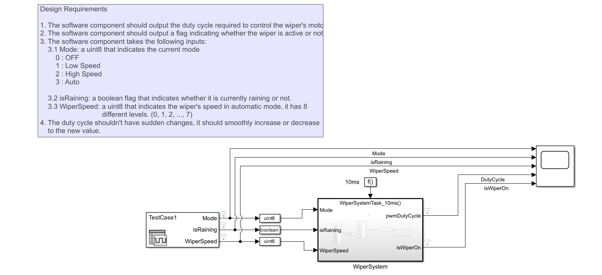

# Automotive Wiper System Simulation and Testing Project
## Overview

This project involves the modeling and verification of an Automotive Wiper System using Simulink. The primary goal is to design a reliable and efficient wiper system that meets the specified requirements. The project includes the development of the system model, simulation using Model-in-the-Loop (MIL) testing against the design requirements.

# Project Components
## 1. System Model

- The system model is developed using Simulink, a powerful simulation tool. The model encompasses the wiper system control logic.

## 2. Design Requirements

- The project adheres to a set of design requirements to ensure the wiper system's performance and functionality. These requirements include speed, and response tim. The Simulink model is designed and tuned to meet these specifications.

## 3. MIL Testing

 - Model-in-the-Loop (MIL) testing is performed to simulate the system's behavior in a virtual environment. This testing phase helps identify any potential issues, validates the model's accuracy, and ensures that the system meets the design requirements. The simulation results are analyzed and compared against expected outcomes.